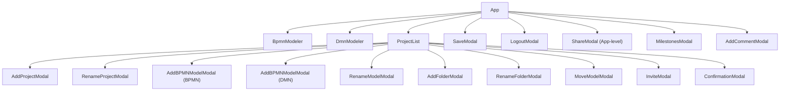

# Component Reference — UI Components

## Context

The frontend is built in React (TypeScript/TSX) using the IBM Carbon Design System. It consists of two imperative modeler wrappers (`BpmnModeler`, `DmnModeler`), one orchestrating list component (`ProjectList`), and fourteen modal dialogs covering project/folder/model management, collaboration, and utility actions. All modals are controlled components (shown/hidden via an `isOpen` prop) and return `null` when closed — except `MoveModelModal`, which has no early-return guard.

---

## 1. Editor wrappers

### BpmnModeler

Full-featured BPMN diagram editor, wrapping the `bpmn-js` library. Exported as a `forwardRef` component so the parent can call imperative methods on the canvas.

**Source:** `src/components/BpmnModeler.tsx`

| Prop | Type | Required | Description |
|------|------|----------|-------------|
| `xml` | `string` | Yes | BPMN 2.0 XML to load into the canvas. Re-importing resets the view. |
| `viewPosition` | `{ zoom: number, scroll: { x, y, width, height } }` | No | If provided, restores the zoom level and scroll offset after XML import. |
| `onModelChange` | `(xml: string) => void` | Yes | Fired on every diagram change event; receives the updated XML. |
| `onViewPositionChange` | `(viewbox: object) => void` | Yes | Fired when the canvas viewport changes; receives the current viewbox. |

**Imperative ref API (via `useImperativeHandle`):**

| Method | Signature | Description |
|--------|-----------|-------------|
| `saveSVG` | `() => Promise<{ svg: string }>` | Returns the current diagram as an SVG string. Used by the parent to export PNG. |
| `handleResize` | `() => void` | Triggers a canvas resize; called by the parent when the side panel opens/closes. |
| `importXML` | `(newXml: string) => Promise<void>` | Programmatically loads new XML into the editor. Used when loading a milestone. |

> **E2E test hook:** in end-to-end test mode (`VITE_FIREBASE_EMULATOR=true`), the underlying `bpmn-js` modeler instance is exposed on `window.__E2E_BPMN__` once the initial XML import resolves, and removed on unmount. This lets the Playwright editor test drive the modeling API directly (see `e2e/editor.spec.ts`). The block is guarded so it is stripped from production builds.

---

### DmnModeler

DMN diagram editor, wrapping `dmn-js`. Supports both the DRD (Decision Requirements Diagram) view and the decision table view; `views.changed` is used to re-export XML when the active view switches.

**Source:** `src/components/DmnModeler.tsx`

| Prop | Type | Required | Description |
|------|------|----------|-------------|
| `xml` | `string` | Yes | DMN 1.3 XML to load. |
| `viewPosition` | `{ zoom: number, scroll: { x, y, width, height } }` | No | Restores viewport after import when provided. |
| `onDMNChange` | `(xml: string) => void` | Yes | Fired after each `views.changed` event; receives the updated XML. |
| `onViewPositionChange` | `(viewbox: object) => void` | Yes | Fired on viewport change. |

**Imperative ref API:**

| Method | Signature | Description |
|--------|-----------|-------------|
| `handleResize` | `() => void` | Canvas resize trigger. |
| `importXML` | `(newXml: string) => Promise<void>` | Loads new XML programmatically. |

> `DmnModeler` does **not** expose `saveSVG` (unlike `BpmnModeler`). The PNG download toolbar button is therefore only shown for BPMN models.

---

## 2. ProjectList

The main view component rendered by `App` for both `ALL_PROJECTS` and `PROJECT` view modes. Owns all project/model/folder CRUD operations and all project-level modal state. Fetches its own invitation list on mount.

**Source:** `src/components/ProjectList.tsx`

| Prop | Type | Required | Description |
|------|------|----------|-------------|
| `user` | `{ uid: string, email: string }` | Yes | Authenticated Firebase user. |
| `viewMode` | `'ALL_PROJECTS' \| 'PROJECT'` | Yes | Determines which table is shown. |
| `currentProject` | Project object | Yes | The open project (may be `{}` in `ALL_PROJECTS` mode). |
| `selectedFolder` | Folder object or `{}` | Yes | The active folder filter (empty object = project root). |
| `onOpenProject` | `(project) => void` | Yes | Navigate into a project. |
| `onOpenModel` | `(project, model) => void` | Yes | Navigate into a model or folder. |
| `onNavigateHome` | `() => void` | Yes | Navigate back to `/`. |
| `projects` | `Project[]` | Yes | Full list of projects for the authenticated user. |
| `fetchUserProjects` | `() => void` | Yes | Callback to trigger a project refresh from the parent. |
| `onOpenShareModal` | `() => void` | Yes | Delegate share modal open to parent (`App`). |

**Behaviour rules (derived from code):**

- Projects are split into two tables: **Your Projects** (`ownerId === user.uid`) and **Shared with me** (all others).
- In the models table, only `bpmn` and `dmn` rows are selectable for batch actions. Folder and `folderUp` rows are not selectable.
- The **Delete Folder** menu item is `disabled` (not hidden) when the folder contains any models.
- DMN model rows render with `cursor: not-allowed` and do not navigate on click.
- The Members panel state (`isMembersPanelOpen`) is persisted to `localStorage`.
- Bulk batch actions (download, duplicate, delete, move) silently filter out any folder items from the selection before acting.
- The `AddBPMNModelModal` is reused for both BPMN and DMN creation; the callback (`handleAddBPMNModel` vs `handleAddDMNModel`) is what differs.

---

## 3. Project & folder modals

| Component | Purpose | Key props | Validation |
|-----------|---------|-----------|-----------|
| `AddProjectModal` | Create a new project | `onAddProject(name)` | Name must be non-empty/non-whitespace. |
| `RenameProjectModal` | Rename an existing project | `onRenameProject(name)`, `currentName` | Name must be non-empty. `currentName` is pre-filled on open. |
| `AddFolderModal` | Create a new folder | `onAddFolder(projectId, name)`, `projectId` | Name must be non-empty/non-whitespace. |
| `RenameFolderModal` | Rename a folder | `onRenameFolder(projectId, name)`, `currentName`, `projectId` | Name must be non-empty. `currentName` is pre-filled on open. |

All four share the same pattern: Enter key submits when valid; primary button disabled when invalid; `null` rendered when `!isOpen`.

**Sources:** `src/components/AddProjectModal.tsx`, `src/components/RenameProjectModal.tsx`, `src/components/AddFolderModal.tsx`, `src/components/RenameFolderModal.tsx`

---

## 4. Model modals

### AddBPMNModelModal

Used for both BPMN and DMN model creation (the calling component passes the appropriate `onAddModel` callback).

**Source:** `src/components/AddBPMNModelModal.tsx`

| Prop | Type | Required | Description |
|------|------|----------|-------------|
| `isOpen` | `boolean` | Yes | Controls visibility. |
| `onClose` | `() => void` | Yes | Close callback. |
| `onAddModel` | `(projectId: string, modelName: string) => void` | Yes | Called with the new name on confirm. |
| `projectId` | `string` | Yes | Parent project for the new model. |

**Validation:**
- Name must match `/^[a-zA-Z_][\w-.\s]*$/` (QName format — starts with a letter or `_`, then alphanumeric / `-` / `.` / space).
- Button is disabled and Enter does not submit if the name is blank or fails the regex.

---

### RenameModelModal

**Source:** `src/components/RenameModelModal.tsx`

| Prop | Type | Required | Description |
|------|------|----------|-------------|
| `isOpen` | `boolean` | Yes | Controls visibility. |
| `onClose` | `() => void` | Yes | Close callback. |
| `onRenameModel` | `(newName: string) => void` | Yes | Called with the new name on confirm. |
| `currentName` | `string` | No | Pre-fills the input on open. |

Same QName validation as `AddBPMNModelModal`.

---

### MoveModelModal

**Source:** `src/components/MoveModelModal.tsx`

| Prop | Type | Required | Description |
|------|------|----------|-------------|
| `isOpen` | `boolean` | Yes | Controls visibility. |
| `onClose` | `() => void` | Yes | Close callback. |
| `onMoveModel` | `(folderId: string \| '') => void` | Yes | Called with target folder ID, or `''` for project root. |
| `folders` | `{ id: string, name: string }[]` | Yes | Available target folders. |
| `currentFolderId` | `string` | No | Pre-selects the current folder; reset when `isOpen` changes. |

> The first option in the select is always "Project root (No Folder)" with an empty string value. `MoveModelModal` is the only modal without a `null` guard on `!isOpen`.

---

## 5. Collaboration modals

### InviteModal

**Source:** `src/components/InviteModal.tsx`

| Prop | Type | Required | Description |
|------|------|----------|-------------|
| `isOpen` | `boolean` | Yes | Controls visibility. |
| `onClose` | `() => void` | Yes | Close callback. |
| `projectId` | `string` | Yes | Project to invite into. |
| `userId` | `string` | Yes | Firebase `uid` of the sender. |

**Behaviour:**
1. Email validated against `/^[^\s@]+@[^\s@]+\.[^\s@]+$/`; button disabled if invalid.
2. Before writing, queries `invitations` by `invitedEmail` and checks for an existing `Pending` entry for the same `projectId`. Blocks with a warning toast if found.
3. Also queries `users` by email; if found, checks `projects/{projectId}/members/{uid}`. Blocks if already a member.
4. Input value is normalised to lower-case on every keystroke.

---

### MilestonesModal

**Source:** `src/components/MilestonesModal.tsx`

| Prop | Type | Required | Description |
|------|------|----------|-------------|
| `isOpen` | `boolean` | Yes | Controls visibility. |
| `onClose` | `() => void` | Yes | Close callback. |
| `model` | `{ id: string, xmlData: string }` | Yes | The currently open model. |
| `user` | `{ uid: string }` | Yes | Authenticated user. |
| `onLoadMilestone` | `(xmlData: string) => void` | Yes | Called with the milestone XML when user confirms a load. |
| `changes` | `boolean` | No | Passed in from parent; accepted but not currently read inside the component. |

**Behaviour:**
- Milestones are fetched from `milestones/{model.id}` when `isOpen` becomes true.
- Displayed in a paginated table, 10 items per page, sorted newest-first.
- **Loading a milestone** enters a confirmation sub-view. The user sees a toggle "Save current state as milestone before loading" (defaults to `true`). If toggled on, the current `model.xmlData` is saved as `State before loading '{milestone.name}'` before `onLoadMilestone` is called.
- The Save button is disabled while `isLoading` is true or the new milestone name is blank.
- Form fields and page reset when the modal closes.

---

## 6. Utility modals

| Component | Source | Props | Behaviour |
|-----------|--------|-------|-----------|
| `AddCommentModal` | `src/components/AddCommentModal.tsx` | `isOpen`, `onClose`, `onAddComment(text)` | Textarea (4 rows). Button disabled when text is blank/whitespace. Text reset on cancel. |
| `ConfirmationModal` | `src/components/ConfirmationModal.tsx` | `isOpen`, `message`, `onClose`, `onConfirm` | Danger-styled confirm dialog. Generic — message supplied by caller. |
| `SaveModal` | `src/components/SaveModal.tsx` | `isOpen`, `onSave`, `onDiscard` | Prompts to save or discard unsaved BPMN/DMN changes before navigating away. |
| `LogoutModal` | `src/components/LogoutModal.tsx` | `isOpen`, `onSaveAndLogout`, `onLogout`, `onClose`, `changes` | When `changes` is true, shows Save + Logout and Discard + Logout. When false, shows a single Logout button. Custom non-Carbon modal. |
| `ShareModal` | `src/components/ShareModal.tsx` | `isOpen`, `onClose`, `url` | Read-only URL input. Copy button uses the Clipboard API; toastr on success/failure. Passive modal (no primary action). |

---

## How it fits together

---

## Related code

### Editor wrappers
- `src/components/BpmnModeler.tsx`
- `src/components/DmnModeler.tsx`

### Main list / orchestration
- `src/components/ProjectList.tsx`

### Project & folder modals
- `src/components/AddProjectModal.tsx`
- `src/components/RenameProjectModal.tsx`
- `src/components/AddFolderModal.tsx`
- `src/components/RenameFolderModal.tsx`

### Model modals
- `src/components/AddBPMNModelModal.tsx`
- `src/components/RenameModelModal.tsx`
- `src/components/MoveModelModal.tsx`

### Collaboration modals
- `src/components/InviteModal.tsx`
- `src/components/MilestonesModal.tsx`

### Utility modals
- `src/components/AddCommentModal.tsx`
- `src/components/ConfirmationModal.tsx`
- `src/components/SaveModal.tsx`
- `src/components/LogoutModal.tsx`
- `src/components/ShareModal.tsx`
