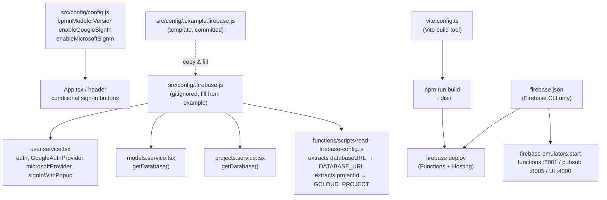

# Data Dictionary — Config

## Context

The `src/config/` directory holds two runtime configuration files consumed by the React frontend and the Cloud Functions build scripts. A third project-root file, `firebase.json`, drives the Firebase CLI for deployments and the local emulator. Application code imports only from `src/config/` — nothing reads from `firebase.json` at runtime.

---

## 1. Application config

A single exported object in `src/config/config.js` that controls feature flags and the application version string. It is a plain JS object with no external dependencies.

**Source:** `src/config/config.js`

| Field | Type | Default | Description |
|-------|------|---------|-------------|
| `bpmnModelerVersion` | `string` | `"0.5.1"` | Human-readable application version, displayed in the UI header. |
| `enableGoogleSignIn` | `boolean` | `true` | When `true`, the "Sign in with Google" button is rendered in the sign-in view. |
| `enableMicrosoftSignIn` | `boolean` | `true` | When `true`, the "Sign in with Microsoft" button is rendered in the sign-in view. |

**Validation:**
- All three fields have no runtime validation — they are read directly wherever needed.
- Setting both `enableGoogleSignIn` and `enableMicrosoftSignIn` to `false` results in no sign-in options being shown.

---

## 2. Firebase config

`src/config/.firebase.js` initialises the Firebase application and exports the auth primitives used throughout `src/services/`. The file is **gitignored** (it may contain API keys). A placeholder template is committed as `src/config/.example.firebase.js` — copy it to `.firebase.js` and fill in real values before running or deploying.

**Source:** `src/config/.example.firebase.js` (template), `src/config/.firebase.js` (gitignored, actual)

### firebaseConfig shape

The `firebaseConfig` object is passed to `initializeApp()`. All fields are strings.

| Field | Description | Example (from template) |
|-------|-------------|------------------------|
| `apiKey` | Firebase Web API key. | `""` |
| `authDomain` | Firebase Auth domain. | `""` (typically `{projectId}.firebaseapp.com`) |
| `databaseURL` | Firebase Realtime Database base URL. Used by RTDB SDK and read by the Cloud Functions build scripts via `functions/scripts/read-firebase-config.js`. | `""` (europe-west1 region in the live config) |
| `projectId` | GCP / Firebase project ID. Used by the Cloud Functions deploy script. | `""` |
| `storageBucket` | Firebase Storage bucket. Present in the config but **not currently used** by the application. | `""` |
| `messagingSenderId` | Firebase Cloud Messaging sender ID. Present in the config but not used at runtime. | `""` |
| `appId` | Firebase Web App ID. | `""` |
| `measurementId` | Google Analytics measurement ID. Present in config but not explicitly used in app code. | `""` |

### Exports

| Export | Type | Description |
|--------|------|-------------|
| `auth` | `Auth` | Firebase Auth instance created from the initialised app. Imported by `user.service.tsx`. |
| `GoogleAuthProvider` | class | Re-exported from `firebase/auth`. Used in `user.service.tsx` for Google OAuth. |
| `microsoftProvider` | `OAuthProvider` | `new OAuthProvider('microsoft.com')`. Used in `user.service.tsx` for Microsoft OAuth. |
| `signInWithPopup` | function | Re-exported from `firebase/auth`. Imported in `user.service.tsx`. |

**Validation:**
- No runtime validation of config values — a missing `databaseURL` will cause all RTDB operations to fail silently or throw at the SDK level.
- The template enforces the shape; all fields must be non-empty strings in a production deployment.

---

## 3. Firebase project config (firebase.json)

`firebase.json` is read exclusively by the Firebase CLI (`firebase deploy`, `firebase emulators:start`). It is not imported by application code.

**Source:** `firebase.json`

### functions

| Field | Value | Description |
|-------|-------|-------------|
| `source` | `"functions"` | Directory containing the Cloud Functions package. |
| `predeploy` | `["npm --prefix functions install", "npm --prefix functions run build"]` | Steps run before every function deploy: install dependencies, then compile TypeScript → `lib/`. |

### hosting

| Field | Value | Description |
|-------|-------|-------------|
| `public` | `"dist"` | Directory served by Firebase Hosting (Vite build output). |
| `ignore` | `["firebase.json", "**/.*", "**/node_modules/**"]` | Files excluded from the hosting upload. |
| `rewrites` | `[{ source: "**", destination: "/index.html" }]` | Catch-all SPA rewrite — all paths serve `index.html` so client-side routing works. |

### emulators

| Emulator | Port | Description |
|----------|------|-------------|
| `functions` | `5001` | Local Firebase Functions emulator. |
| `pubsub` | `8085` | Local Pub/Sub emulator (used to trigger billing-guard functions in development). |
| `ui` | `4000` | Firebase Emulator UI dashboard. |
| `singleProjectMode` | `true` | Emulators operate as a single project, enabling cross-emulator calls. |

---

## 4. Build config (vite.config.ts)

`vite.config.ts` contains the Vite build configuration for the frontend. It is minimal — only the React plugin is registered. No aliases, proxy rules, or environment-variable transforms are configured.

**Source:** `vite.config.ts`

| Setting | Value | Description |
|---------|-------|-------------|
| `plugins` | `[react()]` | `@vitejs/plugin-react` — enables JSX transform and React Fast Refresh in development. |

---

## How it fits together

---

## Related code

### Config files
- `src/config/config.js`
- `src/config/.example.firebase.js`
- `src/config/.firebase.js`

### Firebase project & build
- `firebase.json`
- `vite.config.ts`

### Consumers
- `src/services/user.service.tsx`
- `src/services/models.service.tsx`
- `src/services/projects.service.tsx`
- `functions/scripts/read-firebase-config.js`
