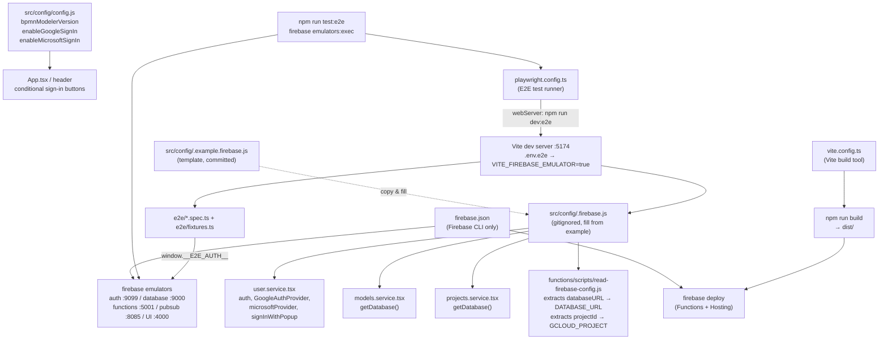

# Data Dictionary — Config

## Context

The `src/config/` directory holds two runtime configuration files consumed by the React frontend and the Cloud Functions build scripts. A third project-root file, `firebase.json`, drives the Firebase CLI for deployments and the local emulator. Application code imports only from `src/config/` — nothing reads from `firebase.json` at runtime.

---

## 1. Application config

A single exported object in `src/config/config.js` that controls feature flags and the application version string. It is a plain JS object with no external dependencies.

**Source:** `src/config/config.js`

| Field | Type | Default | Description |
|-------|------|---------|-------------|
| `bpmnModelerVersion` | `string` | `"0.5.1"` | Human-readable application version, displayed in the UI header. |
| `enableGoogleSignIn` | `boolean` | `true` | When `true`, the "Sign in with Google" button is rendered in the sign-in view. |
| `enableMicrosoftSignIn` | `boolean` | `true` | When `true`, the "Sign in with Microsoft" button is rendered in the sign-in view. |

**Validation:**
- All three fields have no runtime validation — they are read directly wherever needed.
- Setting both `enableGoogleSignIn` and `enableMicrosoftSignIn` to `false` results in no sign-in options being shown.

---

## 2. Firebase config

`src/config/.firebase.js` initialises the Firebase application and exports the auth primitives used throughout `src/services/`. The file is **gitignored** (it may contain API keys). A placeholder template is committed as `src/config/.example.firebase.js` — copy it to `.firebase.js` and fill in real values before running or deploying.

**Source:** `src/config/.example.firebase.js` (template), `src/config/.firebase.js` (gitignored, actual)

### firebaseConfig shape

The `firebaseConfig` object is passed to `initializeApp()`. All fields are strings.

| Field | Description | Example (from template) |
|-------|-------------|------------------------|
| `apiKey` | Firebase Web API key. | `""` |
| `authDomain` | Firebase Auth domain. | `""` (typically `{projectId}.firebaseapp.com`) |
| `databaseURL` | Firebase Realtime Database base URL. Used by RTDB SDK and read by the Cloud Functions build scripts via `functions/scripts/read-firebase-config.js`. | `""` (europe-west1 region in the live config) |
| `projectId` | GCP / Firebase project ID. Used by the Cloud Functions deploy script. | `""` |
| `storageBucket` | Firebase Storage bucket. Present in the config but **not currently used** by the application. | `""` |
| `messagingSenderId` | Firebase Cloud Messaging sender ID. Present in the config but not used at runtime. | `""` |
| `appId` | Firebase Web App ID. | `""` |
| `measurementId` | Google Analytics measurement ID. Present in config but not explicitly used in app code. | `""` |

### Exports

| Export | Type | Description |
|--------|------|-------------|
| `auth` | `Auth` | Firebase Auth instance created from the initialised app. Imported by `user.service.tsx`. |
| `GoogleAuthProvider` | class | Re-exported from `firebase/auth`. Used in `user.service.tsx` for Google OAuth. |
| `microsoftProvider` | `OAuthProvider` | `new OAuthProvider('microsoft.com')`. Used in `user.service.tsx` for Microsoft OAuth. |
| `signInWithPopup` | function | Re-exported from `firebase/auth`. Imported in `user.service.tsx`. |

**Validation:**
- No runtime validation of config values — a missing `databaseURL` will cause all RTDB operations to fail silently or throw at the SDK level.
- The template enforces the shape; all fields must be non-empty strings in a production deployment.

### End-to-end test mode (emulators)

When the app is started with `VITE_FIREBASE_EMULATOR=true` (set by `vite --mode e2e` via `.env.e2e`), the config file points the SDK at the local Firebase emulators and exposes a test hook. The block is guarded so it is stripped from production builds.

| Action | Detail |
|--------|--------|
| `connectAuthEmulator(auth, 'http://127.0.0.1:9099', { disableWarnings: true })` | Routes all Firebase Auth calls to the local Auth emulator. |
| `connectDatabaseEmulator(getDatabase(app), '127.0.0.1', 9000)` | Routes all RTDB calls to the local Database emulator. |
| `window.__E2E_AUTH__ = { auth, signInWithEmailAndPassword, createUserWithEmailAndPassword }` | Test-only hook used by the Playwright fixture (`e2e/fixtures.ts`) to sign in without the OAuth popup. |

The block adds these imports from `firebase/auth` (`connectAuthEmulator`, `signInWithEmailAndPassword`, `createUserWithEmailAndPassword`) and `firebase/database` (`connectDatabaseEmulator`). It is present in both `.example.firebase.js` (committed) and `.firebase.js` (gitignored, actual).

---

## 3. Firebase project config (firebase.json)

`firebase.json` is read exclusively by the Firebase CLI (`firebase deploy`, `firebase emulators:start`). It is not imported by application code.

**Source:** `firebase.json`

### functions

| Field | Value | Description |
|-------|-------|-------------|
| `source` | `"functions"` | Directory containing the Cloud Functions package. |
| `predeploy` | `["npm --prefix functions install", "npm --prefix functions run build"]` | Steps run before every function deploy: install dependencies, then compile TypeScript → `lib/`. |

### hosting

| Field | Value | Description |
|-------|-------|-------------|
| `public` | `"dist"` | Directory served by Firebase Hosting (Vite build output). |
| `ignore` | `["firebase.json", "**/.*", "**/node_modules/**"]` | Files excluded from the hosting upload. |
| `rewrites` | `[{ source: "**", destination: "/index.html" }]` | Catch-all SPA rewrite — all paths serve `index.html` so client-side routing works. |

### emulators

| Emulator | Port | Description |
|----------|------|-------------|
| `auth` | `9099` | Local Firebase Auth emulator. Used by the end-to-end tests to sign in without real OAuth. |
| `database` | `9000` | Local Realtime Database emulator. Used by the end-to-end tests; defaults to allow-all rules. |
| `functions` | `5001` | Local Firebase Functions emulator. |
| `pubsub` | `8085` | Local Pub/Sub emulator (used to trigger billing-guard functions in development). |
| `ui` | `4000` | Firebase Emulator UI dashboard. |
| `singleProjectMode` | `true` | Emulators operate as a single project, enabling cross-emulator calls. |

> No deploy-level `database.rules` key is configured in `firebase.json` — RTDB security rules are managed in the Firebase console, and omitting the key keeps a bare `firebase deploy` from pushing rules to production. The Database emulator therefore defaults to allow-all rules, which is intentional for tests.

---

## 4. Build config (vite.config.ts)

`vite.config.ts` contains the Vite build configuration for the frontend. It is minimal — only the React plugin is registered. No aliases, proxy rules, or environment-variable transforms are configured.

**Source:** `vite.config.ts`

| Setting | Value | Description |
|---------|-------|-------------|
| `plugins` | `[react()]` | `@vitejs/plugin-react` — enables JSX transform and React Fast Refresh in development. |

---

## 5. End-to-end test config (playwright.config.ts)

`playwright.config.ts` configures the Playwright end-to-end test runner. Tests live in `e2e/`. The config auto-starts the Vite dev server (in e2e mode) on a dedicated port before the suite; the Firebase emulators are started around the run by the `test:e2e` / `test:e2e:ui` scripts.

**Source:** `playwright.config.ts`

| Setting | Value | Description |
|---------|-------|-------------|
| `testDir` | `'./e2e'` | Directory containing the `*.spec.ts` test files. |
| `fullyParallel` | `true` | Runs tests across files in parallel. |
| `forbidOnly` | `!!process.env.CI` | Fails the run if `test.only` is left in the source when running on CI. |
| `retries` | `2` on CI, `0` locally | Retry count for failed tests. |
| `workers` | `1` on CI, default locally | Parallel worker count. |
| `reporter` | `'html'` | Generates an HTML report (opened via `npm run test:e2e:report`). |
| `use.baseURL` | `'http://localhost:5174'` | Base URL tests navigate against — a dedicated e2e port so the test server is never confused with a normal `npm run dev` on 5173. |
| `use.trace` | `'on-first-retry'` | Captures a Playwright trace when a test is retried. |
| `projects` | `[chromium, screenshots]` | `chromium` runs the `*.spec.ts` tests (Desktop Chrome; Firefox/WebKit commented out). `screenshots` runs only `*.shots.ts` at a 1440×900 viewport for documentation captures and is excluded from the normal test run. |
| `webServer.command` | `'npm run dev:e2e'` | Command started before the suite (`vite --mode e2e`, loads `.env.e2e`). |
| `webServer.url` | `'http://localhost:5174'` | URL polled until the dev server is ready. |
| `webServer.reuseExistingServer` | `!process.env.CI` | Reuses an already-running dev server locally; always starts fresh on CI. |
| `webServer.timeout` | `120000` | Milliseconds to wait for the dev server to boot. |

**npm scripts (from `package.json`):**

| Script | Command | Description |
|--------|---------|-------------|
| `dev:e2e` | `vite --mode e2e --port 5174 --strictPort` | Dev server in e2e mode on the dedicated port 5174; loads `.env.e2e` (`VITE_FIREBASE_EMULATOR=true`). |
| `emulators` | `firebase emulators:start --only auth,database --project demo-bpmn` | Starts the Auth + Database emulators (for a manual two-terminal UI run). |
| `test:e2e` | `firebase emulators:exec --only auth,database --project demo-bpmn "playwright test --project=chromium"` | Boots the emulators, runs the test suite headless (chromium project only — never the screenshot captures), tears them down. |
| `test:e2e:ui` | `firebase emulators:exec --only auth,database --project demo-bpmn "playwright test --project=chromium --ui"` | Interactive Playwright UI mode; boots the emulators automatically (no separate `npm run emulators` needed). |
| `test:e2e:report` | `playwright show-report` | Opens the last HTML report. |
| `screenshots` | `firebase emulators:exec --only auth,database --project demo-bpmn "playwright test --project=screenshots"` | Captures documentation screenshots (the `screenshots` project) into `docs/assets/screenshots/`. Managed by the `capture-screenshots` skill. |

**Authentication for tests:** the `demo-bpmn` project ID runs the emulators fully offline (no real credentials). The Playwright fixture `e2e/fixtures.ts` signs in via the `window.__E2E_AUTH__` hook (see §2) — creating a throwaway emulator user — so authenticated specs run as a logged-in user against an isolated, reset-each-run database. The pre-auth smoke tests (`e2e/sign-in.spec.ts`) need no sign-in.

**Test coverage:**

| Spec | What it covers |
|------|----------------|
| `e2e/sign-in.spec.ts` | Pre-auth screen: app shell loads, Google/Microsoft sign-in buttons render. |
| `e2e/projects.spec.ts` | After sign-in: the "Your Projects" view and Add Project action render. |
| `e2e/project-crud.spec.ts` | Authenticated CRUD: create a project, open it, rename it (verified via the list), add a folder, add a BPMN model. Each test uses a unique name (`uniqueName` in `e2e/fixtures.ts`) so tests stay independent on the shared emulator database. |
| `e2e/editor.spec.ts` | BPMN editor: open a model, draw a task off the start event via the modeling API (exposed on `window.__E2E_BPMN__`), save it, and confirm the task persisted by reloading and re-reading the saved XML. |

**Documentation screenshots:** the `screenshots` Playwright project (run via `npm run screenshots`) captures UI images into `docs/assets/screenshots/`. Shots are defined in `e2e/screenshots/manifest.ts` and captured serially by `e2e/screenshots/capture.shots.ts` (toasts hidden, fixed names for deterministic images). This is driven by the `capture-screenshots` skill; the images are committed and embedded in the Markdown docs and their HTML twins.

**Notes:**
- The dev server requires a valid `src/config/.firebase.js` to boot (Firebase is initialised at module load). In CI, generate it from `.example.firebase.js` with dummy values — the emulators run in demo mode and need no real keys.
- The Firebase CLI requires Node.js ≥ 20 (the repo pins 22 in `.nvmrc`); the emulators require a JVM (Java) on the `PATH`.
- Browser binaries are installed separately via `npx playwright install chromium`.

---

## How it fits together

---

## Related code

### Config files
- `src/config/config.js`
- `src/config/.example.firebase.js`
- `src/config/.firebase.js`

### Firebase project & build
- `firebase.json`
- `vite.config.ts`

### Testing
- `playwright.config.ts`
- `.env.e2e`
- `e2e/fixtures.ts`
- `e2e/sign-in.spec.ts`
- `e2e/projects.spec.ts`
- `e2e/project-crud.spec.ts`
- `e2e/editor.spec.ts`
- `e2e/screenshots/manifest.ts`
- `e2e/screenshots/capture.shots.ts`

### Consumers
- `src/services/user.service.tsx`
- `src/services/models.service.tsx`
- `src/services/projects.service.tsx`
- `functions/scripts/read-firebase-config.js`
