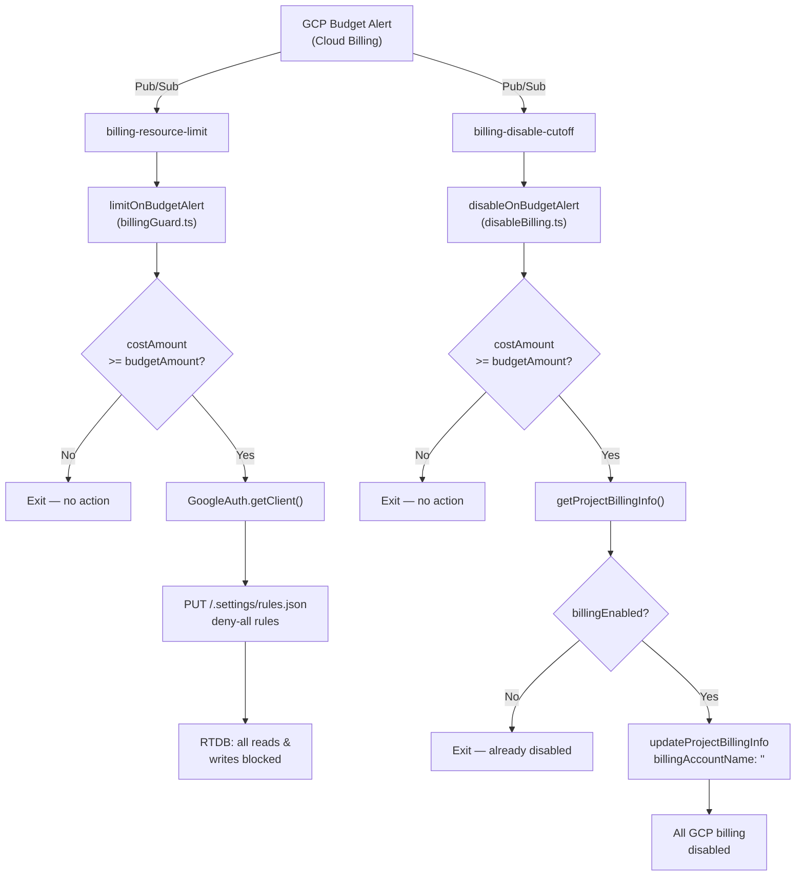

# Data Dictionary — Cloud Functions

## Context

The `functions/` package contains two Firebase Cloud Functions v2 that protect the project from runaway GCP spend. Both are triggered by Google Cloud Budget Alert Pub/Sub messages and act as escalating guards: the first locks the Firebase Realtime Database (blocking all reads and writes); the second, if a harder threshold is crossed, removes the GCP billing account entirely and stops all billable resources.

---

## 1. `limitOnBudgetAlert`

Pub/Sub-triggered function that overwrites Firebase RTDB security rules with a deny-all policy when a budget threshold is reached.

**Source:** `functions/src/billingGuard.ts`

| Attribute | Value |
|-----------|-------|
| Export name | `limitOnBudgetAlert` |
| Trigger | `onMessagePublished` (Firebase Functions v2) |
| Pub/Sub topic | `billing-resource-limit` |
| Runtime env var | `DATABASE_URL` — base URL of the Firebase Realtime Database |

**Incoming Pub/Sub message payload** (base64-encoded JSON in `event.data.message.data`):

| Field | Type | Required | Description |
|-------|------|----------|-------------|
| `costAmount` | `number` | Yes | USD amount spent in the billing period. |
| `budgetAmount` | `number` | No | Budget threshold in USD. Defaults to `0` if absent. |

**Action (when `costAmount >= budgetAmount`):**

1. Authenticates via `GoogleAuth` with scope `https://www.googleapis.com/auth/firebase`.
2. Issues a `PUT` request to `${DATABASE_URL}/.settings/rules.json` with body `{ ".read": false, ".write": false }`.
3. All Firebase RTDB reads and writes are blocked immediately.

**Validation / edge cases:**
- If `budgetAmount` is missing from the payload, it defaults to `0`. Any positive `costAmount` therefore triggers the lock.
- `0 >= 0` evaluates to `true`, so a `{ costAmount: 0, budgetAmount: 0 }` (or a payload with both values absent/zero) also triggers the lock. This edge case is documented in the test suite.
- If `costAmount < budgetAmount`, no action is taken and the function returns silently.

---

## 2. `disableOnBudgetAlert`

Pub/Sub-triggered function that removes the project's GCP billing account, stopping all billable GCP resources.

**Source:** `functions/src/disableBilling.ts`

| Attribute | Value |
|-----------|-------|
| Export name | `disableOnBudgetAlert` |
| Trigger | `onMessagePublished` (Firebase Functions v2) |
| Pub/Sub topic | `billing-disable-cutoff` |
| Runtime env var | `GCLOUD_PROJECT` — the GCP project ID |

**Incoming Pub/Sub message payload** (same structure as `limitOnBudgetAlert`):

| Field | Type | Required | Description |
|-------|------|----------|-------------|
| `costAmount` | `number` | No | USD amount spent. Defaults to `0` if absent. |
| `budgetAmount` | `number` | No | Budget threshold in USD. Defaults to `0` if absent. |

**Action (when `costAmount >= budgetAmount`):**

1. Calls `billing.getProjectBillingInfo({ name: "projects/${PROJECT_ID}" })`.
2. If `billingEnabled` is already `false`, exits without further action (idempotent).
3. Otherwise calls `billing.updateProjectBillingInfo` with `billingAccountName: ""` (empty string removes the billing account from the project).
4. All billable GCP resources are stopped.

**Validation / edge cases:**
- When `costAmount < budgetAmount`, the function exits before calling any billing API.
- The idempotency check (`billingEnabled === false`) prevents redundant API calls on repeated alert messages.

---

## 3. Configuration & environment

Both functions rely on two environment variables that are resolved from `src/config/.firebase.js` at build / deploy / test time by `functions/scripts/read-firebase-config.js`.

| Variable | Source | Used by |
|----------|--------|---------|
| `DATABASE_URL` | `databaseURL` field in `src/config/.firebase.js` | `limitOnBudgetAlert` (RTDB rules PUT endpoint) |
| `GCLOUD_PROJECT` | `projectId` field in `src/config/.firebase.js` | `disableOnBudgetAlert` (billing API resource name) |

`src/config/.firebase.js` is the single source of truth for Firebase environment values across the frontend, the functions, and the test runner.

---

## 4. Build, deploy & emulate

| npm script | What it does |
|------------|-------------|
| `npm run build` | Compiles TypeScript → `lib/` via `tsc` |
| `npm run deploy` | Reads `projectId` from config, runs `firebase deploy --only functions --project {projectId}` |
| `npm run emulate` | Runs `sync-config` then builds and starts the local Firebase Emulator |
| `npm run test` | Runs `sync-config` (to inject env vars) then Jest |

**Source:** `functions/scripts/deploy.js`, `functions/scripts/sync-config.js`, `functions/scripts/start-emulator.js`

---

## How it fits together

---

## Related code

### Functions
- `functions/src/billingGuard.ts`
- `functions/src/disableBilling.ts`
- `functions/src/index.ts`

### Tests
- `functions/src/billingGuard.test.ts`
- `functions/src/disableBilling.test.ts`

### Scripts & config
- `functions/scripts/deploy.js`
- `functions/scripts/read-firebase-config.js`
- `functions/scripts/sync-config.js`
- `functions/scripts/start-emulator.js`
- `functions/jest.setup.js`
