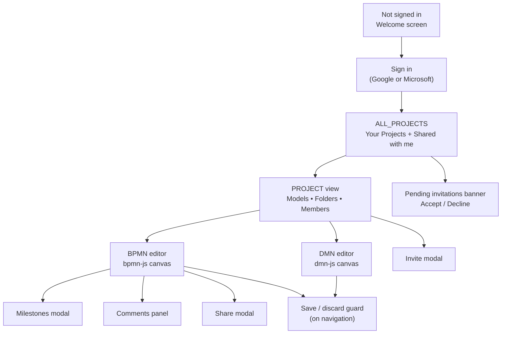

# User Guide — BPMN Modeler

## Context

BPMN Modeler is an open-source, browser-based tool for creating and collaborating on BPMN 2.0 (process diagrams) and DMN 1.3 (decision tables). It requires a Google or Microsoft account to sign in, stores all data in Firebase Realtime Database, and runs entirely in the browser — no installation required. This guide documents every feature currently implemented in the application.

---

## 1. Getting started

### Sign in

The sign-in buttons shown in the header are controlled by two feature flags in `src/config/config.js`:

| Button | Flag | Default |
|--------|------|---------|
| Sign in with Google | `enableGoogleSignIn` | `true` |
| Sign in with Microsoft | `enableMicrosoftSignIn` | `true` |

Both open a browser pop-up. On first sign-in a new user record is created in the database with your email, display name, and profile avatar. On subsequent sign-ins the record is updated with the latest profile data and a `lastLogin` timestamp.

**Google avatar** — taken directly from the Google profile photo.

**Microsoft avatar** — fetched from the Microsoft Graph API (`/me/photo/$value`) using the OAuth access token. The image is stored as a base64 data URL.

**Cross-provider account linking** — if you attempt to sign in with a provider (e.g. Google) and the email address already belongs to an account created with the other provider (Microsoft), the application automatically links the two credentials to one account. You can then sign in with either provider.

### Sign out

Click your avatar in the top-right corner and choose **Logout**. If you have unsaved diagram changes, a dialog asks whether to save them first before signing out.

### Welcome screen

When not signed in, the application shows a welcome screen with the app name and tagline. All project and editor views are gated behind authentication.

---

## 2. Projects

### Viewing your projects

Once signed in, the home screen shows two tables:

| Table | Contents |
|-------|---------|
| **Your Projects** | Projects where you are the owner (`ownerId === your user ID`). |
| **Shared with me** | Projects where another user is the owner but you are a member. |

Each row shows the project name, number of models, last changed date, and member avatars (up to 4 avatars; overflow shown as `+N`).

Columns are sortable — click any column header to sort ascending; click again for descending.

### Creating a project

Click **Add Project**. Enter a name (must be non-empty) and confirm. The project is immediately created with you as the sole `owner` member.

### Opening a project

Click any project row to navigate to the project view (`/project/{name}`).

### Renaming a project

Open the project, then click the overflow menu (⋮) in the project heading and choose **Rename Project**. Only the project owner sees this option.

### Deleting a project

Overflow menu → **Delete Project** (owner only). Confirmation required. Deletes the project record, all its BPMN/DMN models, all XML data, all milestones, and all invitations.

### Leaving a project

Overflow menu → **Leave Project** (non-owners only). Confirmation required. Removes you from the member list and from your personal project index.

### Pending invitations

If you have pending invitations, a banner appears above the project list. Each invitation shows the project name and sender. You can **Accept** (adds you as an `editor`) or **Decline** (marks the invitation declined; it is not deleted from the database).

---

## 3. Folders

Folders exist inside a project and are used to organise models. They are **embedded inside the project record** in the database (not a separate top-level collection). A folder can be created only at the project root — you cannot nest folders inside other folders.

### Creating a folder

In the project view, click **Add Folder** in the toolbar (only visible when you are at the project root, not inside a folder). Enter a name.

### Opening a folder

Click the folder row in the models table. The URL changes to `/project/{name}/folder/{folderName}` and the table shows only the models inside that folder. A `..` entry at the top of the list navigates back to the project root.

### Renaming a folder

Overflow menu on the folder row → **Rename** (available to folder owner or project owner).

### Deleting a folder

Overflow menu → **Delete Folder**. This option is **disabled** (greyed out, not hidden) when the folder still contains models. The folder must be empty before it can be deleted.

---

## 4. Models

### Model types

| Type | File format | Icon | Notes |
|------|------------|------|-------|
| BPMN | `.bpmn` | Process/flow icon | Fully supported. |
| DMN | `.dmn` | Table icon | Can be created, uploaded, and stored; editor has limited support — opening a DMN model from the project side panel is marked `not-allowed`. |

### Creating a model

Click **Add BPMN** or **Add DMN** in the toolbar. Enter a name — it must match the pattern `/^[a-zA-Z_][\w-.\s]*$/` (start with a letter or underscore; only letters, digits, `_`, `-`, `.`, and spaces allowed). A camelCase version of the name is used as the XML process/decision `id`.

A new BPMN model is created with a minimal template: `bpmn:definitions` → `bpmn:process` with a single start event. A new DMN model is created with a single `decision` containing one decision table with one input and one output.

### Importing a model from file

Click **Import** to open the file picker. You may select multiple `.bpmn` and/or `.dmn` files at once. The model name is extracted from the XML (`bpmn:process name` or `decision name` attribute); if that attribute is absent the filename (minus extension) is used.

### Opening a model for editing

Click any model row. The URL changes to `/project/{name}/model/{id}`. If you have unsaved changes in the currently open model, a warning toast is shown and navigation is blocked until you save or discard. DMN models in the project side panel cannot be opened from there (cursor shows `not-allowed`).

### Renaming a model

Overflow menu → **Rename** (model owner or project owner). Same name validation as creation. On rename, the XML `id` and `name` attributes of the root process/decision element are updated to match, keeping the XML and the display name in sync.

### Duplicating a model

Overflow menu → **Duplicate**. Creates a copy with " Copy" appended to the name, in the same folder as the original. The full XML is copied.

### Moving a model to a folder

Overflow menu → **Move to...** (model/project owner). A dialog shows all folders in the project plus a "Project root (No Folder)" option. Select the destination and confirm.

### Downloading a model

Overflow menu → **Download**. Downloads the current XML as a `.bpmn` or `.dmn` file. The filename is derived from the process/decision name converted to kebab-case.

### Deleting a model

Overflow menu → **Delete Model** (model owner or project owner). Confirmation required. Deletes the model metadata, XML data, and all milestones. The model is removed from the project index.

### Bulk actions

Select models using the checkboxes in the models table (only BPMN and DMN rows are selectable; folders cannot be selected). A batch actions bar appears with:

| Action | Who can use it |
|--------|---------------|
| **Download** | Any member |
| **Duplicate** | Any member |
| **Delete** | Project owner only |
| **Move to...** | Project owner only |

Folder items are silently filtered out of the selection before any bulk action is applied.

### Sorting the models table

Click any column header (Name, Type, Owner, Last Changed) to sort.

---

## 5. The editor

### BPMN editor

Powered by `bpmn-js`. Features available:
- Drag-and-drop BPMN 2.0 elements (tasks, events, gateways, sequence flows, etc.)
- Colour picker for diagram elements
- Minimap for overview navigation
- Zoom (mouse wheel) and pan (drag canvas)
- Standard keyboard shortcuts (undo `Ctrl+Z`, redo, copy/paste, delete, etc.)

### DMN editor

Powered by `dmn-js`. Supports two views:
- **DRD view** — Decision Requirements Diagram showing decision dependencies
- **Decision Table view** — row/column decision rule table

Switching between views triggers an XML export so changes are not lost.

### Saving

The **Save** button is shown in the toolbar when there are unsaved changes. Click it to write the XML to the database. For DMN models, Save is always available (not gated on a changes flag).

**Auto-save** (BPMN only) — toggle the Auto-save switch in the toolbar. When on, every diagram change is saved automatically and the Save button stays disabled.

The auto-save preference is persisted to `localStorage` (`autoSave` key) and survives page reloads.

### Downloading from the editor

| Button | What it downloads |
|--------|------------------|
| **Download BPMN** icon | `.bpmn` XML file (BPMN only) |
| **Download as image** icon | `.png` at 1.5× resolution, rendered via SVG export (BPMN only) |

DMN download is not available from the editor toolbar; use the model row overflow menu from the project view instead.

### Sharing

The **Share** button copies the current page URL. Only project members can open the link.

### Unsaved-changes guard

Any navigation action (breadcrumb, sidebar item, browser back) while there are unsaved changes opens a **Save or Discard** dialog. Navigation is blocked until the user chooses.

### Resizable panels

Two side panels are resizable by dragging their edge dividers. Sizes are persisted to `localStorage`.

| Panel | localStorage key | Default | Min/max |
|-------|-----------------|---------|---------|
| Project sidebar (left) | `sidePanelWidth` | 250 px | 150 – 800 px |
| Comments panel (right) | `commentsPanelWidth` | 300 px | 200 – 800 px |

---

## 6. Project sidebar (in editor)

The left sidebar shows the contents of the current project while you are in the editor. Toggle it with the panel icon in the toolbar.

Contents (in order):
1. `.. / {folder name}` — navigate up to project root (only shown when inside a folder)
2. Folders at the current level (bold, alphabetical)
3. Models at the current level (alphabetical, filtered to the current folder)

Click a sidebar item to navigate. If you have unsaved changes, a warning toast blocks navigation and you must save first. DMN model items show a `not-allowed` cursor and do not navigate.

The sidebar's open/closed state is persisted to `localStorage` (`isProjectViewerOpen` key).

---

## 7. Milestones (version history)

Each model has its own milestone list — named snapshots of the XML at a point in time.

Open the milestone list with the **Milestones** button in the editor toolbar. Milestones are displayed in a paginated table (10 per page), sorted newest-first.

### Saving a milestone

Enter a name and optional description, then click **Save Milestone**. The current XML is stored with a `createdAt` timestamp and your user ID.

### Loading a milestone

Click **Load** on any milestone row. A confirmation sub-view appears with a toggle (default: on) labelled "Save current state as milestone before loading". If left on, the current model XML is automatically saved as a new milestone named `State before loading '{milestone name}'` before the selected version is loaded. This protects against accidental overwrites.

### Deleting a milestone

Click **Delete** on a milestone row. Confirmation required. Deletion is permanent.

---

## 8. Comments

The comments panel is accessible via the chat icon in the editor toolbar. It can be opened and closed independently of the project sidebar.

### Adding a comment

Click **Add Comment** in the panel header. A modal opens with a text area. Submit to post the comment. Comments are stored with your display name, user ID, and a timestamp.

### Viewing comments

Comments are listed newest-first with the author name and a formatted timestamp (`YYYY-MM-DD HH:MM`).

### Deleting a comment

The trash icon appears only on your own comments. Click it to delete — no confirmation dialog, deletion is immediate.

---

## 9. Team collaboration

### Inviting a member

In the project view, open the **Members** panel (group icon) and click **Invite**. Enter the invitee's email address (Google or Microsoft account). The Invite button is disabled until the email passes validation (`/^[^\s@]+@[^\s@]+\.[^\s@]+$/`).

Before sending, two checks run against the database:
1. Is there already a `Pending` invitation for this email + project? → blocked with a warning.
2. Is this email already a member of the project? → blocked with a warning.

The email is normalised to lower-case before storage.

### Member roles

| Role | How assigned | Permissions |
|------|-------------|-------------|
| `owner` | Automatically on project creation | Can rename/delete the project, remove members, and perform all model operations |
| `editor` | Assigned when an invitation is accepted | Can create, rename, duplicate, download, and delete their own models |

### Removing a member

In the Members panel, open the overflow menu on a member row → **Remove member** (only project owner can do this, and only for other members — not themselves). Confirmation required.

### Members panel visibility

The members panel open/closed state is persisted to `localStorage` (`isMembersPanelOpen` key).

---

## How it fits together

---

## Related code

### App shell & routing
- `src/App.tsx`

### Project, folder & model management
- `src/components/ProjectList.tsx`
- `src/services/projects.service.tsx`
- `src/services/models.service.tsx`

### Authentication & user record
- `src/services/user.service.tsx`

### Editor wrappers
- `src/components/BpmnModeler.tsx`
- `src/components/DmnModeler.tsx`

### Modals
- `src/components/AddProjectModal.tsx`
- `src/components/RenameProjectModal.tsx`
- `src/components/AddBPMNModelModal.tsx`
- `src/components/RenameModelModal.tsx`
- `src/components/AddFolderModal.tsx`
- `src/components/RenameFolderModal.tsx`
- `src/components/MoveModelModal.tsx`
- `src/components/InviteModal.tsx`
- `src/components/MilestonesModal.tsx`
- `src/components/AddCommentModal.tsx`
- `src/components/ConfirmationModal.tsx`
- `src/components/SaveModal.tsx`
- `src/components/LogoutModal.tsx`
- `src/components/ShareModal.tsx`

### Utilities
- `src/services/utils.service.tsx`

### Configuration
- `src/config/config.js`
