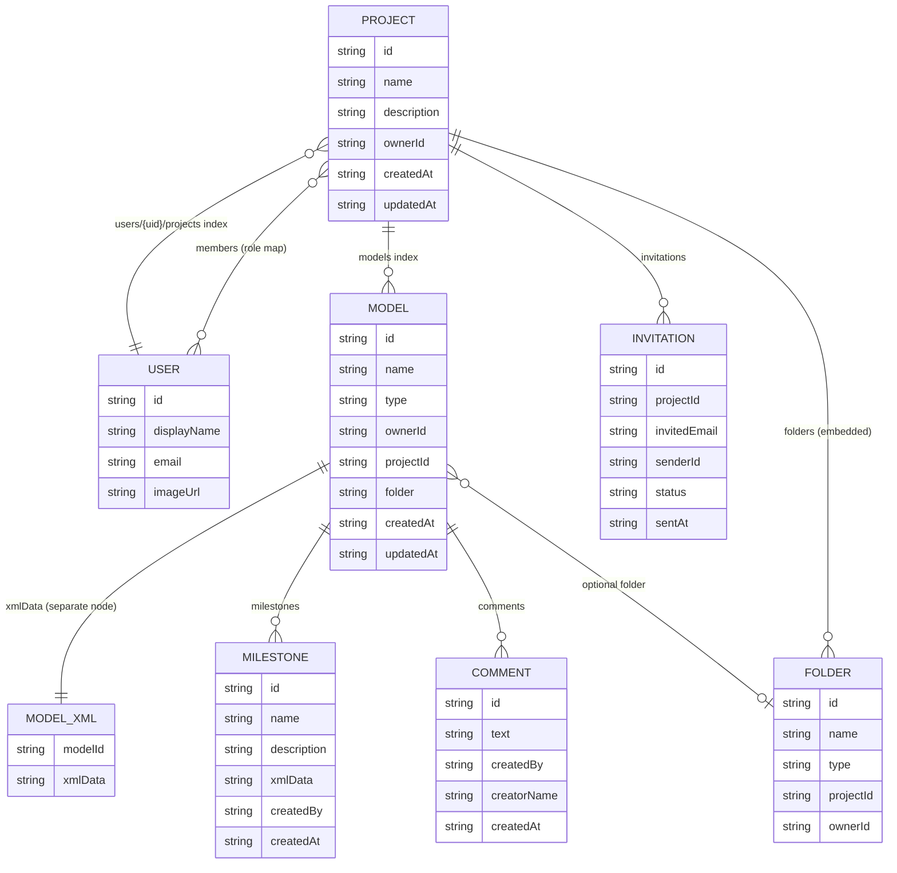

# Data Dictionary — Projects

## Context

The **projects** domain is the top-level organisational unit of the BPMN Modeler. A project groups BPMN and DMN models, optional folders, and a set of members who collaborate on those models. The frontend fetches projects from Firebase Realtime Database on login and keeps them in application state; all create, update, and delete operations go directly to RTDB via the Firebase JS SDK.

---

## 1. Project

A container for models, folders, and collaborating members.

**Source:** `src/components/ProjectList.tsx`

| Field | Type | Required | Description |
|-------|------|----------|-------------|
| `name` | `string` | Yes | Human-readable project name; used as the URL segment (`/project/{name}`). |
| `description` | `string` | No | Free-text description; defaults to `''` on creation. |
| `ownerId` | `string` | Yes | Firebase Auth `uid` of the user who created the project. |
| `createdAt` | `string` (ISO 8601) | Yes | Creation timestamp, set once at project creation. |
| `updatedAt` | `string` (ISO 8601) | Yes | Last-modified timestamp; updated on any structural change (rename, model add/delete, member change). |
| `members` | `{ [userId: string]: MemberRole }` | Yes | Map of member user IDs to their role. Always contains at least the owner. |
| `models` | `{ [modelId: string]: true }` | No | Sparse index of model IDs belonging to this project. |
| `folders` | `{ [folderId: string]: Folder }` | No | Embedded folder objects keyed by auto-generated ID. |

**RTDB path:** `projects/{projectId}`

**Validation:**
- `name` must be non-empty (enforced in `AddProjectModal`).
- `members` is initialised with `{ [ownerId]: 'owner' }` on creation.

---

## 2. Model (`bpmnModels`)

A BPMN or DMN diagram. Both types are stored in the same RTDB collection (`bpmnModels`); the `type` field distinguishes them.

**Source:** `src/services/models.service.tsx`, `src/components/ProjectList.tsx`

| Field | Type | Required | Description |
|-------|------|----------|-------------|
| `name` | `string` | Yes | Display name; also embedded in the XML as the process/decision `name` attribute on creation. |
| `type` | `'bpmn' \| 'dmn'` | Yes | Model type; determines which editor opens and which XML template is used. |
| `ownerId` | `string` | Yes | Firebase Auth `uid` of the user who created or last saved the model. |
| `projectId` | `string` | Yes | ID of the parent project. Used to index models back to their project. |
| `folder` | `string \| null` | No | ID of the containing `Folder`, or `null` when the model is at the project root. |
| `createdAt` | `string` (ISO 8601) | Yes | Creation timestamp; set once, never updated on save. |
| `updatedAt` | `string` (ISO 8601) | Yes | Last-saved timestamp; updated on every save and on rename. |

**RTDB path:** `bpmnModels/{modelId}`

**Validation:**
- `name` must match `/^[a-zA-Z_][\w-.\s]*$/` — must start with a letter or underscore, followed by alphanumeric characters, underscores, hyphens, periods, or spaces (QName-compatible format). Enforced in `AddBPMNModelModal`.
- A camelCase-converted form of the name (`camelize(name)`) is used as the XML `id` attribute for the BPMN process or DMN decision on creation and rename.

---

## 3. Model XML data (`modelXmlData`)

The raw XML content of a model is stored separately to keep model metadata lightweight.

**Source:** `src/services/models.service.tsx`

| Field | Type | Required | Description |
|-------|------|----------|-------------|
| `xmlData` | `string` | Yes | Full BPMN 2.0 or DMN 1.3 XML document. |

**RTDB path:** `modelXmlData/{modelId}/xmlData`

---

## 4. Folder

An optional grouping within a project. Folders are embedded directly inside the project document (not a top-level collection) and hold no models themselves — models reference the folder via `bpmnModels/{id}/folder`.

**Source:** `src/components/ProjectList.tsx`

| Field | Type | Required | Description |
|-------|------|----------|-------------|
| `name` | `string` | Yes | Display name of the folder. |
| `type` | `'folder'` | Yes | Constant discriminator; always `'folder'`. |
| `projectId` | `string` | Yes | ID of the parent project. |
| `ownerId` | `string` | Yes | Firebase Auth `uid` of the user who created the folder. |

**RTDB path:** `projects/{projectId}/folders/{folderId}`

**Validation:**
- A folder can only be deleted when it contains no models (`currentProject.models.filter(m => m.folder === folderId).length === 0`). The "Delete Folder" menu item is disabled otherwise.

---

## 5. Milestone

A named snapshot of a model's XML at a point in time. Used for lightweight version history.

**Source:** `src/services/models.service.tsx`

| Field | Type | Required | Description |
|-------|------|----------|-------------|
| `name` | `string` | Yes | User-given label for the milestone. |
| `description` | `string` | Yes | Free-text description. |
| `xmlData` | `string` | Yes | Full XML snapshot of the model at this point. |
| `createdBy` | `string` | Yes | Firebase Auth `uid` of the user who saved the milestone. |
| `createdAt` | `string` (ISO 8601) | Yes | Creation timestamp. |

**RTDB path:** `milestones/{modelId}/{milestoneId}`

---

## 6. Comment

A text comment attached to a model.

**Source:** `src/services/models.service.tsx`

| Field | Type | Required | Description |
|-------|------|----------|-------------|
| `text` | `string` | Yes | Comment body. |
| `createdBy` | `string` | Yes | Firebase Auth `uid` of the author. |
| `creatorName` | `string` | Yes | `displayName` of the author at the time of creation (denormalised). |
| `createdAt` | `string` (ISO 8601) | Yes | Creation timestamp. |

**RTDB path:** `comments/{modelId}/{commentId}`

---

## 7. Invitation

A pending, accepted, or declined invitation to join a project.

**Source:** `src/components/InviteModal.tsx`, `src/components/ProjectList.tsx`

| Field | Type | Required | Description |
|-------|------|----------|-------------|
| `projectId` | `string` | Yes | ID of the project the invite is for. |
| `invitedEmail` | `string` | Yes | Email address of the invitee (stored lower-case). |
| `senderId` | `string` | Yes | Firebase Auth `uid` of the user who sent the invite. |
| `status` | `InvitationStatus` | Yes | Lifecycle state. |
| `sentAt` | `string` (ISO 8601) | Yes | When the invite was sent. |

**RTDB path:** `invitations/{invitationId}`

**Validation:**
- `invitedEmail` must match `/^[^\s@]+@[^\s@]+\.[^\s@]+$/`.
- A second `Pending` invite to the same email + project is blocked (deduplication checked before write).
- If the invitee is already a member of the project, the invite is blocked.
- Accepting sets `status → 'Accepted'` and adds the user to `projects/{id}/members/{uid}` as `'editor'`.
- Declining sets `status → 'Declined'`; the document is not removed.

---

## Enums & status codes

### MemberRole

| Value | Meaning |
|-------|---------|
| `'owner'` | Created the project; can rename, delete, add/remove members. |
| `'editor'` | Added via invitation; can create, rename, duplicate, download, and delete own models. |

### InvitationStatus

| Value | Meaning |
|-------|---------|
| `'Pending'` | Invite sent, awaiting response. Shown in the UI banner. |
| `'Accepted'` | Invitee accepted; user was added to the project as `'editor'`. |
| `'Declined'` | Invitee declined; document retained for audit, not shown in UI. |

### Model type

| Value | Meaning |
|-------|---------|
| `'bpmn'` | Business Process Model and Notation diagram. |
| `'dmn'` | Decision Model and Notation table. DMN is stored but opening in the editor is not yet fully supported (cursor shows `not-allowed` in the side panel). |

---

## How it fits together

---

## Related code

### Services
- `src/services/projects.service.tsx`
- `src/services/models.service.tsx`

### Components
- `src/components/ProjectList.tsx`
- `src/components/AddProjectModal.tsx`
- `src/components/RenameProjectModal.tsx`
- `src/components/AddBPMNModelModal.tsx`
- `src/components/RenameModelModal.tsx`
- `src/components/AddFolderModal.tsx`
- `src/components/RenameFolderModal.tsx`
- `src/components/MoveModelModal.tsx`
- `src/components/InviteModal.tsx`
- `src/components/MilestonesModal.tsx`

### App root (data fetch + routing)
- `src/App.tsx`
