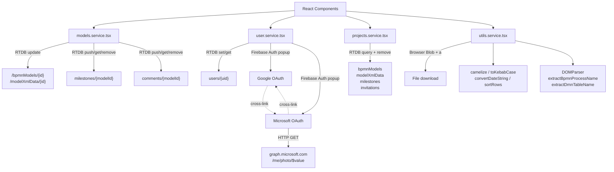

# Data Dictionary — Services

## Context

The `src/services/` directory contains every function that communicates with Firebase Realtime Database, Firebase Authentication, and the Microsoft Graph API, plus a set of pure browser-side helpers. React components import from these files rather than calling Firebase or browser APIs directly. Two files (`download.service.tsx`, `invites.service.tsx`) exist in the directory but are empty stubs with no exports.

---

## 1. models.service.tsx

CRUD operations for BPMN/DMN model metadata and XML data, milestones, and comments. All reads and writes use the Firebase Realtime Database SDK.

**Source:** `src/services/models.service.tsx`

### saveBPMNModel(model)

Atomically writes model metadata and XML data in a single multi-path `update` call.

| RTDB path | Fields written |
|-----------|----------------|
| `/bpmnModels/{model.id}` | `name`, `type: 'bpmn'`, `ownerId`, `folder` (or `null`), `projectId`, `updatedAt` |
| `/modelXmlData/{model.id}/xmlData` | `model.xmlData` |

**Notes:**
- `folder` is set to `model.folder || null` — a missing folder is stored as `null`, not omitted.
- `updatedAt` is set to `new Date().toISOString()` on every call. `createdAt` is not written on save; it is set only at creation time and preserved on subsequent saves.
- Returns `Promise<void>`; logs success to the console.

---

### saveDMNodel(model)

Atomically writes DMN model metadata and XML data. **Note:** this function name contains a typo (`saveDMNodel`, not `saveDMNModel`).

| RTDB path | Fields written |
|-----------|----------------|
| `/bpmnModels/{model.id}` | `name`, `type: 'dmn'`, `ownerId`, `projectId`, `updatedAt` |
| `/modelXmlData/{model.id}/xmlData` | `model.xmlData` |

**Notes:**
- Unlike `saveBPMNModel`, no `folder` field is written — DMN models do not track folder placement in this function.
- Returns `Promise<void>`.

---

### saveMilestone(modelId, name, description, xmlData, userId)

Pushes a new milestone under `milestones/{modelId}` using `push` (Firebase auto-generated key).

| RTDB path | Fields written |
|-----------|----------------|
| `milestones/{modelId}/{autoKey}` | `name`, `description`, `xmlData`, `createdBy: userId`, `createdAt` |

Returns `Promise<void>`.

---

### getMilestones(modelId): Promise\<Milestone[]\>

Reads the full `milestones/{modelId}` subtree in a single `get` call and returns the items sorted **newest-first** by `createdAt`.

**Returned shape per item:** `{ id: key, name, description, xmlData, createdBy, createdAt }`

Returns `[]` if the path does not exist.

---

### deleteMilestone(modelId, milestoneId)

Removes `milestones/{modelId}/{milestoneId}`. Returns `Promise<void>`.

---

### saveComment(modelId, text, user)

Pushes a new comment under `comments/{modelId}` using `push`.

| RTDB path | Fields written |
|-----------|----------------|
| `comments/{modelId}/{autoKey}` | `text`, `createdBy: user.uid`, `creatorName: user.displayName \|\| 'Unknown'`, `createdAt` |

Returns `Promise<void>`.

---

### getComments(modelId): Promise\<Comment[]\>

Reads the full `comments/{modelId}` subtree and returns items sorted **newest-first** by `createdAt`.

**Returned shape per item:** `{ id: key, text, createdBy, creatorName, createdAt }`

Returns `[]` if the path does not exist.

---

### deleteComment(modelId, commentId)

Removes `comments/{modelId}/{commentId}`. Returns `Promise<void>`.

---

## 2. user.service.tsx

Firebase Authentication sign-in flows and user record management in RTDB.

**Source:** `src/services/user.service.tsx`

### signInWithGoogle()

Opens a Google OAuth pop-up (`signInWithPopup`). On success, upserts the user record at `users/{uid}`:

| Condition | RTDB path | Fields written |
|-----------|-----------|----------------|
| New user | `users/{uid}` | `email`, `displayName`, `imageUrl: photoURL`, `createdAt` |
| Existing user | `users/{uid}` | All previous fields (spread), plus updated `email`, `displayName`, `imageUrl: photoURL`, `lastLogin` |

**Cross-provider linking — `auth/account-exists-with-different-credential`:**
1. Extracts the Google `pendingCred` from the error.
2. Opens a Microsoft sign-in pop-up.
3. On success, calls `linkWithCredential(microsoftResult.user, pendingCred)` to attach the Google credential to the existing Microsoft account.

---

### signInWithMicrosoft()

Opens a Microsoft OAuth pop-up (`OAuthProvider('microsoft.com')`). On success:
1. Fetches the user avatar from the Microsoft Graph API:
   `GET https://graph.microsoft.com/v1.0/me/photo/$value` with `Authorization: Bearer {accessToken}`.
2. Encodes the `ArrayBuffer` response as `data:image/jpeg;base64,{base64}`.
3. Upserts `users/{uid}` with the same field set as `signInWithGoogle`, using the base64 avatar as `imageUrl`.

**Cross-provider linking — `auth/account-exists-with-different-credential`:**
1. Extracts the Microsoft `pendingCred`.
2. Opens a Google sign-in pop-up.
3. Calls `linkWithCredential(googleResult.user, pendingCred)` to attach the Microsoft credential to the existing Google account.

---

### logout()

Calls `signOut(auth)`. Returns `Promise<void>`.

---

## 3. projects.service.tsx

Cascade-delete helper invoked when a project is permanently deleted.

**Source:** `src/services/projects.service.tsx`

### deleteModelsAndInvites(projectId)

Deletes all models, XML data, milestones, and invitations belonging to a project.

| Step | RTDB query | Removals per matched key |
|------|-----------|--------------------------|
| 1 | `bpmnModels` where `projectId == projectId` | `bpmnModels/{key}`, `modelXmlData/{key}`, `milestones/{key}` |
| 2 | `invitations` where `projectId == projectId` | `invitations/{key}` |

**Validation / edge cases:**
- `comments/{key}` is **not** removed — comments are not cleaned up on project deletion.
- Individual `remove` calls inside the `forEach` are fire-and-forget (no `await`); the returned promise resolves when the queries complete, not when all removes do.

---

## 4. utils.service.tsx

Pure functions and browser-API helpers used across components. No Firebase calls.

**Source:** `src/services/utils.service.tsx`

### extractBpmnProcessName(xmlString: string): string | null

Parses `xmlString` as XML and returns the `name` attribute of the first `bpmn:process` element. Returns `null` if no such element is found.

---

### extractDmnTableName(xmlString: string): string | null

Parses `xmlString` as XML and returns the `name` attribute of the first `decision` element. Returns `null` if not found.

---

### camelize(str): string

Converts a string to camelCase. Lowercases the first word; uppercases the first letter of every subsequent word; removes all whitespace.

**Example:** `"my process name"` → `"myProcessName"`

---

### toKebabCase(str): string

Converts a string to kebab-case. Lowercases everything; collapses whitespace and underscores to hyphens; strips characters that are not `a–z`, `0–9`, or `-`.

**Example:** `"My Process Name"` → `"my-process-name"`

---

### convertDateString(inputDateString: string): string

Converts an ISO 8601 timestamp to a `YYYY-MM-DD HH:MM` display string by splitting on `T` and `:` and discarding seconds and timezone.

**Example:** `"2024-01-15T09:30:45.000Z"` → `"2024-01-15 09:30"`

---

### renderMembersCell(members): JSX.Element

Renders member avatars for the project-list table. Shows up to 4 circular `` elements (30×30 px). If the member count exceeds 4, appends `+{extraCount}` as a text node. Each avatar has a `title` tooltip of `"{displayName} ({role})"`.

---

### sortRows(rows, header, direction): array

Sorts `rows` **in-place** by the `header` field and returns the same array.

| `direction` value | Effective sort |
|-------------------|----------------|
| `'NONE'` | No sort — all comparisons return `0`. |
| `'DESC'` | Ascending by `rows[n][header]` (naming is inverted relative to convention). |
| Any other value | Descending by `rows[n][header]` (implied `'ASC'`). |

**Note:** The sort direction labels are inverted. The value `'DESC'` produces ascending order; the absence of `'DESC'` or `'NONE'` produces descending order.

---

### downloadXmlAsBpmn(model): void

Triggers a file download in the browser.

1. Creates a `Blob` from `model.xmlData` with MIME type `text/xml`.
2. Derives the filename:
   - BPMN: `toKebabCase(extractBpmnProcessName(xmlData) ?? model.name) + '.bpmn'`
   - DMN: `toKebabCase(extractDmnTableName(xmlData) ?? model.name) + '.dmn'`
3. Creates a temporary `<a>`, appends it to the DOM (required for Firefox), calls `.click()`, then removes it.

---

## 5. Empty stubs

Two service files in `src/services/` contain no code:

| File | Status |
|------|--------|
| `src/services/download.service.tsx` | Empty — no exports |
| `src/services/invites.service.tsx` | Empty — no exports |

---

## How it fits together

---

## Related code

### Services
- `src/services/models.service.tsx`
- `src/services/user.service.tsx`
- `src/services/projects.service.tsx`
- `src/services/utils.service.tsx`
- `src/services/download.service.tsx`
- `src/services/invites.service.tsx`

### Configuration
- `src/config/.firebase.js`
