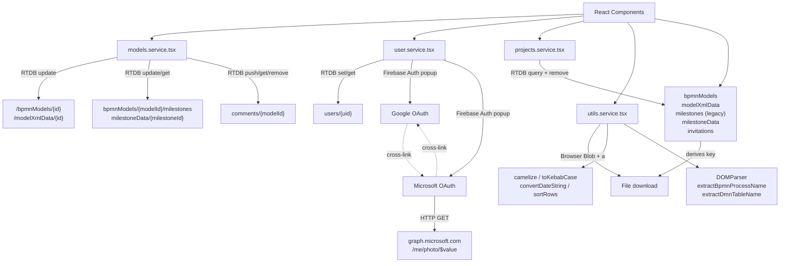

# Data Dictionary — Services

## Context

The `src/services/` directory contains every function that communicates with Firebase Realtime Database, Firebase Authentication, and the Microsoft Graph API, plus a set of pure browser-side helpers. React components import from these files rather than calling Firebase or browser APIs directly. One file (`download.service.tsx`) exists in the directory but is an empty stub with no exports.

---

## 1. models.service.tsx

CRUD operations for BPMN/DMN model metadata and XML data, milestones, comments, and collaborative persistence. All reads and writes use the Firebase Realtime Database SDK.

**Source:** `src/services/models.service.tsx`

### saveBPMNModel(model)

Atomically writes model metadata and XML data in a single multi-path `update` call.

| RTDB path | Fields written |
|-----------|----------------|
| `/bpmnModels/{model.id}/name` | `model.name` |
| `/bpmnModels/{model.id}/type` | `'bpmn'` |
| `/bpmnModels/{model.id}/ownerId` | `model.ownerId` |
| `/bpmnModels/{model.id}/folder` | `model.folder` (or `null`) |
| `/bpmnModels/{model.id}/projectId` | `model.projectId` |
| `/bpmnModels/{model.id}/updatedAt` | `new Date().toISOString()` |
| `/modelXmlData/{model.id}/xmlData` | `model.xmlData` |

**Notes:**
- Fields are written **individually** rather than by replacing the whole `bpmnModels/{model.id}` node. This preserves the `milestones` child stored under the model (see [Milestone metadata](projects.md#5a-milestone-metadata)), which a whole-node replacement would delete.
- `folder` is set to `model.folder || null` — a missing folder is stored as `null`, not omitted.
- `updatedAt` is set to `new Date().toISOString()` on every call. `createdAt` is not written on save; it is set only at creation time and preserved on subsequent saves.
- Returns `Promise<void>`; logs success to the console.

---

### saveDMNodel(model)

Atomically writes DMN model metadata and XML data. **Note:** this function name contains a typo (`saveDMNodel`, not `saveDMNModel`).

| RTDB path | Fields written |
|-----------|----------------|
| `/bpmnModels/{model.id}/name` | `model.name` |
| `/bpmnModels/{model.id}/type` | `'dmn'` |
| `/bpmnModels/{model.id}/ownerId` | `model.ownerId` |
| `/bpmnModels/{model.id}/projectId` | `model.projectId` |
| `/bpmnModels/{model.id}/updatedAt` | `new Date().toISOString()` |
| `/modelXmlData/{model.id}/xmlData` | `model.xmlData` |

**Notes:**
- Like `saveBPMNModel`, fields are written individually so the model's `milestones` child is preserved across saves.
- Unlike `saveBPMNModel`, no `folder` field is written — DMN models do not track folder placement in this function.
- Returns `Promise<void>`.

---

### persistCollaborativeXml(modelId, xml)

Writes only the XML and touches `updatedAt`, in a single multi-path `update`. Used by the real-time collaboration **persistence leader** — the single client per editing session that writes the shared document back to the database, on a slow debounce decoupled from the faster live-sync cadence.

| RTDB path | Fields written |
|-----------|----------------|
| `/modelXmlData/{modelId}/xmlData` | `xml` |
| `/bpmnModels/{modelId}/updatedAt` | `new Date().toISOString()` |

**Notes:**
- Only the XML and `updatedAt` are written; model metadata (`name`, `type`, `ownerId`, `projectId`, `folder`) is left untouched, since it does not change while editing the diagram.
- Because exactly one elected leader writes the document per session, concurrent editors no longer overwrite each other's whole file — this replaces the silent last-writer-wins behaviour of the per-edit auto-save path while collaborating.
- Returns `Promise<void>`; logs errors to the console.

---

### saveMilestone(modelId, name, description, xmlData, userId)

Generates a milestone ID (`push(ref(db, 'milestoneData')).key`) and writes the milestone in **two parts** in a single multi-path `update` call: lightweight metadata under the model, and the XML snapshot separately.

| RTDB path | Fields written |
|-----------|----------------|
| `/bpmnModels/{modelId}/milestones/{milestoneId}` | `name`, `description`, `createdBy: userId`, `createdAt` |
| `/milestoneData/{milestoneId}` | `modelId`, `xmlData` |

Returns `Promise<string>` — the generated `milestoneId`.

> `modelId` is the back-reference the security rules resolve access through: a snapshot keyed only by its own id cannot be tied to a project.

---

### getMilestones(modelId): Promise\<Milestone[]\>

Reads the metadata subtree `bpmnModels/{modelId}/milestones` in a single `get` call and returns the items sorted **newest-first** by `createdAt`. The XML snapshots are **not** loaded here.

**Returned shape per item:** `{ id: key, name, description, createdBy, createdAt }`

Returns `[]` if the path does not exist.

---

### getMilestoneXml(milestoneId): Promise\<string | null\>

Fetches a single milestone's XML snapshot on demand from `milestoneData/{milestoneId}/xmlData`. Returns `null` if the path does not exist. Called when a milestone is actually loaded, so the list view never has to read the heavy XML.

---

### getModelMilestoneIds(modelId): Promise\<string[]\>

Returns the milestone IDs for a model by reading the keys of `bpmnModels/{modelId}/milestones`. Used by cascade deletes to clean up the associated `milestoneData/{milestoneId}` entries, which live outside the model node. Returns `[]` if the model has no milestones.

---

### deleteMilestone(modelId, milestoneId)

Removes both parts of a milestone in a single multi-path `update`: the metadata at `/bpmnModels/{modelId}/milestones/{milestoneId}` and the snapshot at `/milestoneData/{milestoneId}`. Returns `Promise<void>`.

---

### saveComment(modelId, text, user)

Pushes a new comment under `comments/{modelId}` using `push`.

| RTDB path | Fields written |
|-----------|----------------|
| `comments/{modelId}/{autoKey}` | `text`, `createdBy: user.uid`, `creatorName: user.displayName \|\| 'Unknown'`, `createdAt` |

Returns `Promise<void>`.

---

### getComments(modelId): Promise\<Comment[]\>

Reads the full `comments/{modelId}` subtree and returns items sorted **newest-first** by `createdAt`.

**Returned shape per item:** `{ id: key, text, createdBy, creatorName, createdAt }`

Returns `[]` if the path does not exist.

---

### deleteComment(modelId, commentId)

Removes `comments/{modelId}/{commentId}`. Returns `Promise<void>`.

---

## 2. user.service.tsx

Firebase Authentication sign-in flows and user record management in RTDB.

**Source:** `src/services/user.service.tsx`

### signInWithGoogle()

Opens a Google OAuth pop-up (`signInWithPopup`). On success, upserts the user record at `users/{uid}`:

| Condition | RTDB path | Fields written |
|-----------|-----------|----------------|
| New user | `users/{uid}` | `email`, `displayName`, `imageUrl: photoURL`, `createdAt` |
| Existing user | `users/{uid}` | All previous fields (spread), plus updated `email`, `displayName`, `imageUrl: photoURL`, `lastLogin` |

**Cross-provider linking — `auth/account-exists-with-different-credential`:**
1. Extracts the Google `pendingCred` from the error.
2. Opens a Microsoft sign-in pop-up.
3. On success, calls `linkWithCredential(microsoftResult.user, pendingCred)` to attach the Google credential to the existing Microsoft account.

---

### signInWithMicrosoft()

Opens a Microsoft OAuth pop-up (`OAuthProvider('microsoft.com')`). On success:
1. Fetches the user avatar from the Microsoft Graph API:
   `GET https://graph.microsoft.com/v1.0/me/photo/$value` with `Authorization: Bearer {accessToken}`.
2. Encodes the `ArrayBuffer` response as `data:image/jpeg;base64,{base64}`.
3. Upserts `users/{uid}` with the same field set as `signInWithGoogle`, using the base64 avatar as `imageUrl`.

**Cross-provider linking — `auth/account-exists-with-different-credential`:**
1. Extracts the Microsoft `pendingCred`.
2. Opens a Google sign-in pop-up.
3. Calls `linkWithCredential(googleResult.user, pendingCred)` to attach the Microsoft credential to the existing Google account.

---

### logout()

Calls `signOut(auth)`. Returns `Promise<void>`.

---

## 3. projects.service.tsx

Cascade-delete helper invoked when a project is permanently deleted.

**Source:** `src/services/projects.service.tsx`

### deleteProjectCascade(projectId, userId)

Deletes a project and everything hanging off it — models, XML data, milestone snapshots and invitations — as a **single atomic multi-path update**.

| Step | RTDB query | Paths collected |
|------|-----------|-----------------|
| 1 | `projects/{projectId}` (read) | the member list, for clearing the reverse index |
| 2 | `bpmnModels` where `projectId == projectId` | `bpmnModels/{key}` (includes the model's milestone metadata child), `modelXmlData/{key}`, `milestones/{key}` (legacy pre-migration layout), and `milestoneData/{milestoneId}` for each milestone under the model |
| 3 | `invitations` where `projectId == projectId` | `invitations/{key}` |
| 4 | — | `users/{memberId}/projects/{projectId}` (every member when the caller is the owner, otherwise only their own) and finally `projects/{projectId}` |

**Validation / edge cases:**
- Order and atomicity are load-bearing. Access to a model is resolved through its project and to XML/snapshots through their model, so deleting a parent before its dependants would leave them unreachable *and* make the security rules refuse the deletes that clean them up. One update authorises every path against the state before it, while the chain is still intact.
- The milestone XML snapshots (`milestoneData/{milestoneId}`) live outside the model node, so they are collected explicitly using the milestone IDs read from each model's `milestones` child.
- `comments/{key}` is **not** removed — comments are not cleaned up on project deletion.
- Only the owner may clear *other* members' index entries (the rules allow exactly that); a non-owner member deleting a project clears only their own.

---

## 4. utils.service.tsx

Pure functions and browser-API helpers used across components. No Firebase calls.

**Source:** `src/services/utils.service.tsx`

### extractBpmnProcessName(xmlString: string): string | null

Parses `xmlString` as XML and returns the `name` attribute of the first `bpmn:process` element. Returns `null` if no such element is found.

---

### extractDmnTableName(xmlString: string): string | null

Parses `xmlString` as XML and returns the `name` attribute of the first `decision` element. Returns `null` if not found.

---

### camelize(str): string

Converts a string to camelCase. Lowercases the first word; uppercases the first letter of every subsequent word; removes all whitespace.

**Example:** `"my process name"` → `"myProcessName"`

---

### toKebabCase(str): string

Converts a string to kebab-case. Lowercases everything; collapses whitespace and underscores to hyphens; strips characters that are not `a–z`, `0–9`, or `-`.

**Example:** `"My Process Name"` → `"my-process-name"`

---

### convertDateString(inputDateString: string): string

Converts an ISO 8601 timestamp to a `YYYY-MM-DD HH:MM` display string by splitting on `T` and `:` and discarding seconds and timezone.

**Example:** `"2024-01-15T09:30:45.000Z"` → `"2024-01-15 09:30"`

---

### renderMembersCell(members): JSX.Element

Renders member avatars for the project-list table. Shows up to 4 circular `` elements (30×30 px). If the member count exceeds 4, appends `+{extraCount}` as a text node. Each avatar has a `title` tooltip of `"{displayName} ({role})"`.

---

### sortRows(rows, header, direction): array

Sorts `rows` **in-place** by the `header` field and returns the same array.

| `direction` value | Effective sort |
|-------------------|----------------|
| `'NONE'` | No sort — all comparisons return `0`. |
| `'DESC'` | Ascending by `rows[n][header]` (naming is inverted relative to convention). |
| Any other value | Descending by `rows[n][header]` (implied `'ASC'`). |

**Note:** The sort direction labels are inverted. The value `'DESC'` produces ascending order; the absence of `'DESC'` or `'NONE'` produces descending order.

---

### downloadXmlAsBpmn(model): void

Triggers a file download in the browser.

1. Creates a `Blob` from `model.xmlData` with MIME type `text/xml`.
2. Derives the filename:
   - BPMN: `toKebabCase(extractBpmnProcessName(xmlData) ?? model.name) + '.bpmn'`
   - DMN: `toKebabCase(extractDmnTableName(xmlData) ?? model.name) + '.dmn'`
3. Creates a temporary `<a>`, appends it to the DOM (required for Firefox), calls `.click()`, then removes it.

---

## 5. invites.service.tsx

Derives the database key of an invitation. Invitations are keyed deterministically by project + invited address rather than by a push id, because the security rules must be able to *find* the invitation that authorises a user to add themselves to a project's members — and rules cannot search, so the key has to be derivable from the project id and `auth.token.email`. A deterministic key also makes inviting idempotent, which removes any need to read other people's invitations to check for a duplicate.

**Source:** `src/services/invites.service.tsx`

### encodeEmailKey(email): string

Lower-cases the address and escapes every character the Realtime Database forbids in a key, in this order:

| Character | Escaped as |
|-----------|-----------|
| `%` | `%25` |
| `.` | `,` |
| `#` | `%23` |
| `$` | `%24` |
| `[` | `%5B` |
| `]` | `%5D` |
| `/` | `%2F` |

`%` is escaped first so the mapping stays injective — otherwise `a%23b@x` and `a#b@x` would collide, and a collision would hand one address the invitation belonging to another.

### invitationKey(projectId, email): string

Returns `` `${projectId}_${encodeEmailKey(email)}` ``.

> This escaping is mirrored by the `.replace()` chains in `database.rules.json` and by `functions/scripts/migrate-security-backfill.js`. All three must change together.

---

## 6. Empty stubs

One service file in `src/services/` contains no code:

| File | Status |
|------|--------|
| `src/services/download.service.tsx` | Empty — no exports |

---

## How it fits together

```mermaid
flowchart TD
    A[React Components] --> B[models.service.tsx]
    A --> C[user.service.tsx]
    A --> D[projects.service.tsx]
    A --> E[utils.service.tsx]
    A --> M[invites.service.tsx]
    M -->|derives key| N["invitations/{projectId}_{encoded email}"]

    B -->|RTDB update| F["/bpmnModels/{id}\n/modelXmlData/{id}"]
    B -->|RTDB update/get| G["bpmnModels/{modelId}/milestones\nmilestoneData/{milestoneId}"]
    B -->|RTDB push/get/remove| H["comments/{modelId}"]

    C -->|RTDB set/get| I["users/{uid}"]
    C -->|Firebase Auth popup| J[Google OAuth]
    C -->|Firebase Auth popup| K[Microsoft OAuth]
    K -->|HTTP GET| L["graph.microsoft.com\n/me/photo/$value"]
    J -.->|cross-link| K
    K -.->|cross-link| J

    D -->|RTDB query + remove| M["bpmnModels\nmodelXmlData\nmilestones (legacy)\nmilestoneData\ninvitations"]

    E -->|Browser Blob + a| N[File download]
    E --> O["camelize / toKebabCase\nconvertDateString / sortRows"]
    E --> P["DOMParser\nextractBpmnProcessName\nextractDmnTableName"]
```

---

## Related code

### Services
- `src/services/models.service.tsx`
- `src/services/user.service.tsx`
- `src/services/projects.service.tsx`
- `src/services/utils.service.tsx`
- `src/services/download.service.tsx`
- `src/services/invites.service.tsx`

### Configuration
- `src/config/.firebase.js`
